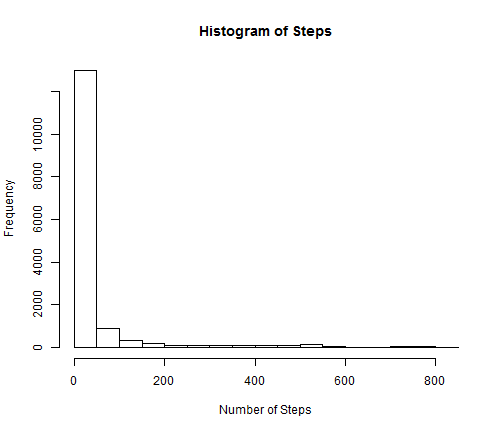
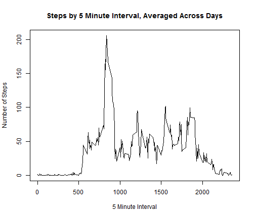
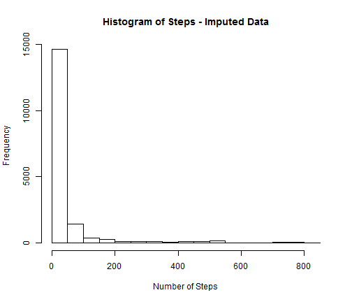
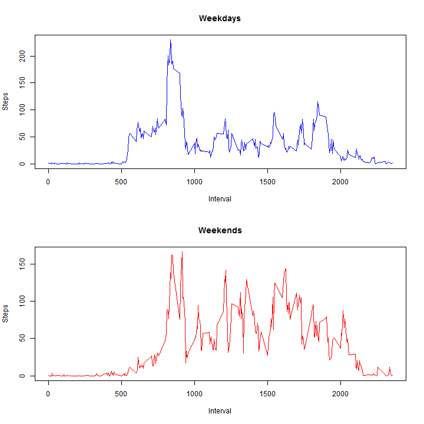

<h1>Reproductible Research - Peer Assessment 1</h1>

<h2> Loading and preprocessing the data </h2>

```r
#Setting the working drive
setwd("C:/Users/Mike/Documents/Online Courses/Coursera/Reproducible Research/RepData_PeerAssessment1")
#loading raw data
Assign1.Dat<- read.csv("activity.csv")
#Removing NA's from data for calculations
Assign1.Dat.clean <- na.omit(Assign1.Dat)
```

<h2> What is mean total number of steps taken per day? </h2>

<h3> Histogram of the total number of steps taken each day </h3>

```r
#histogram of all steps
hist(Assign1.Dat.clean$steps, main ="Histogram of Steps", xlab = "Number of Steps")
```

 

<h3> Mean and median total number of steps taken per day </h3>

```r
#mean of all steps
mean(na.omit(Assign1.Dat.clean$steps))
```

```
## [1] 37.38
```

```r
#median of all steps
median(na.omit(Assign1.Dat.clean$steps))
```

```
## [1] 0
```

```r
#Using tapply to get mean of steps per day
as.data.frame(tapply(Assign1.Dat.clean$steps, Assign1.Dat.clean$date, mean))
```

```
##            tapply(Assign1.Dat.clean$steps, Assign1.Dat.clean$date, mean)
## 2012-10-01                                                            NA
## 2012-10-02                                                        0.4375
## 2012-10-03                                                       39.4167
## 2012-10-04                                                       42.0694
## 2012-10-05                                                       46.1597
## 2012-10-06                                                       53.5417
## 2012-10-07                                                       38.2465
## 2012-10-08                                                            NA
## 2012-10-09                                                       44.4826
## 2012-10-10                                                       34.3750
## 2012-10-11                                                       35.7778
## 2012-10-12                                                       60.3542
## 2012-10-13                                                       43.1458
## 2012-10-14                                                       52.4236
## 2012-10-15                                                       35.2049
## 2012-10-16                                                       52.3750
## 2012-10-17                                                       46.7083
## 2012-10-18                                                       34.9167
## 2012-10-19                                                       41.0729
## 2012-10-20                                                       36.0938
## 2012-10-21                                                       30.6285
## 2012-10-22                                                       46.7361
## 2012-10-23                                                       30.9653
## 2012-10-24                                                       29.0104
## 2012-10-25                                                        8.6528
## 2012-10-26                                                       23.5347
## 2012-10-27                                                       35.1354
## 2012-10-28                                                       39.7847
## 2012-10-29                                                       17.4236
## 2012-10-30                                                       34.0938
## 2012-10-31                                                       53.5208
## 2012-11-01                                                            NA
## 2012-11-02                                                       36.8056
## 2012-11-03                                                       36.7049
## 2012-11-04                                                            NA
## 2012-11-05                                                       36.2465
## 2012-11-06                                                       28.9375
## 2012-11-07                                                       44.7326
## 2012-11-08                                                       11.1771
## 2012-11-09                                                            NA
## 2012-11-10                                                            NA
## 2012-11-11                                                       43.7778
## 2012-11-12                                                       37.3785
## 2012-11-13                                                       25.4722
## 2012-11-14                                                            NA
## 2012-11-15                                                        0.1424
## 2012-11-16                                                       18.8924
## 2012-11-17                                                       49.7882
## 2012-11-18                                                       52.4653
## 2012-11-19                                                       30.6979
## 2012-11-20                                                       15.5278
## 2012-11-21                                                       44.3993
## 2012-11-22                                                       70.9271
## 2012-11-23                                                       73.5903
## 2012-11-24                                                       50.2708
## 2012-11-25                                                       41.0903
## 2012-11-26                                                       38.7569
## 2012-11-27                                                       47.3819
## 2012-11-28                                                       35.3576
## 2012-11-29                                                       24.4688
## 2012-11-30                                                            NA
```

```r
#Using tapply to get median of steps per day
as.data.frame(tapply(Assign1.Dat.clean$steps, Assign1.Dat.clean$date, median))
```

```
##            tapply(Assign1.Dat.clean$steps, Assign1.Dat.clean$date, median)
## 2012-10-01                                                              NA
## 2012-10-02                                                               0
## 2012-10-03                                                               0
## 2012-10-04                                                               0
## 2012-10-05                                                               0
## 2012-10-06                                                               0
## 2012-10-07                                                               0
## 2012-10-08                                                              NA
## 2012-10-09                                                               0
## 2012-10-10                                                               0
## 2012-10-11                                                               0
## 2012-10-12                                                               0
## 2012-10-13                                                               0
## 2012-10-14                                                               0
## 2012-10-15                                                               0
## 2012-10-16                                                               0
## 2012-10-17                                                               0
## 2012-10-18                                                               0
## 2012-10-19                                                               0
## 2012-10-20                                                               0
## 2012-10-21                                                               0
## 2012-10-22                                                               0
## 2012-10-23                                                               0
## 2012-10-24                                                               0
## 2012-10-25                                                               0
## 2012-10-26                                                               0
## 2012-10-27                                                               0
## 2012-10-28                                                               0
## 2012-10-29                                                               0
## 2012-10-30                                                               0
## 2012-10-31                                                               0
## 2012-11-01                                                              NA
## 2012-11-02                                                               0
## 2012-11-03                                                               0
## 2012-11-04                                                              NA
## 2012-11-05                                                               0
## 2012-11-06                                                               0
## 2012-11-07                                                               0
## 2012-11-08                                                               0
## 2012-11-09                                                              NA
## 2012-11-10                                                              NA
## 2012-11-11                                                               0
## 2012-11-12                                                               0
## 2012-11-13                                                               0
## 2012-11-14                                                              NA
## 2012-11-15                                                               0
## 2012-11-16                                                               0
## 2012-11-17                                                               0
## 2012-11-18                                                               0
## 2012-11-19                                                               0
## 2012-11-20                                                               0
## 2012-11-21                                                               0
## 2012-11-22                                                               0
## 2012-11-23                                                               0
## 2012-11-24                                                               0
## 2012-11-25                                                               0
## 2012-11-26                                                               0
## 2012-11-27                                                               0
## 2012-11-28                                                               0
## 2012-11-29                                                               0
## 2012-11-30                                                              NA
```

<h2> What is the average daily activity pattern? </h2>


<h3> Time series plot of the 5-minute interval and the average number of steps taken, averaged across all days </h3>

```r
#Avg steps by interval
##Calculating mean by interval using aggregate
avgsteps <- aggregate(Assign1.Dat.clean$steps ~ Assign1.Dat.clean$interval, FUN = mean)
colnames(avgsteps) <- c("interval", "steps")
#Time series plot
plot(avgsteps$interval,avgsteps$steps, 
     main = "Steps by 5 Minute Interval, Averaged Across Days",
     xlab = "5 Minute Interval",
     ylab = "Number of Steps",
     type = "l")
```

 

<h3> Which 5-minute interval, on average across all the days in the dataset, contains the maximum number of steps? </h3>

Interval 835 contains the maximum number of steps.


```r
#Creating a sorted version of hte dataset by number of steps
avgsteps.sort <- avgsteps[order(as.numeric(-avgsteps[,2])),]
#Returning top row from sorted dataset
avgsteps.sort[1,]
```

```
##     interval steps
## 104      835 206.2
```

<h2> Imputing missing values </h2>

<h3> Total number of missing values in the dataset </h3>
There are 2304 missing values in this dataset

```r
#Calculating number of NA's from the orignal dataset
sum(is.na(Assign1.Dat))
```

```
## [1] 2304
```

<h3> Strategy for filling in all of the missing values in the dataset </h3>

```r
#Going to replace NA's with the mean of the interval from avgsteps
##Using transform command to set steps from avgsteps
Assign1.Dat.impute <- transform(Assign1.Dat, 
                                steps = ifelse((is.na(steps)) 
                                               & (interval == avgsteps$interval),
                                               avgsteps$steps, steps))
```

<h3> New dataset that is equal to the original dataset but with the missing data filled in </h3>

```r
#Going to replace NA's with the mean of the interval from avgsteps
#First 10 lines from original data
Assign1.Dat[1:10,]
```

```
##    steps       date interval
## 1     NA 2012-10-01        0
## 2     NA 2012-10-01        5
## 3     NA 2012-10-01       10
## 4     NA 2012-10-01       15
## 5     NA 2012-10-01       20
## 6     NA 2012-10-01       25
## 7     NA 2012-10-01       30
## 8     NA 2012-10-01       35
## 9     NA 2012-10-01       40
## 10    NA 2012-10-01       45
```

```r
#First 10 lines from imputed data
Assign1.Dat.impute[1:10,]
```

```
##      steps       date interval
## 1  1.71698 2012-10-01        0
## 2  0.33962 2012-10-01        5
## 3  0.13208 2012-10-01       10
## 4  0.15094 2012-10-01       15
## 5  0.07547 2012-10-01       20
## 6  2.09434 2012-10-01       25
## 7  0.52830 2012-10-01       30
## 8  0.86792 2012-10-01       35
## 9  0.00000 2012-10-01       40
## 10 1.47170 2012-10-01       45
```

<h3> Histogram of the total number of steps taken each day </h3>

```r
#histogram of all steps with new data
hist(Assign1.Dat.impute$steps, main ="Histogram of Steps - Imputed Data", xlab = "Number of Steps")
```

 

<h4> Calculate and report the mean and median total number of steps taken per day </h4>

```r
#mean of all steps
mean(Assign1.Dat.impute$steps)
```

```
## [1] 37.38
```

```r
#median of all steps
median(Assign1.Dat.impute$steps)
```

```
## [1] 0
```

```r
#Using tapply to get mean of steps per day
as.data.frame(tapply(Assign1.Dat.impute$steps, Assign1.Dat.impute$date, mean))
```

```
##            tapply(Assign1.Dat.impute$steps, Assign1.Dat.impute$date, mean)
## 2012-10-01                                                         37.3826
## 2012-10-02                                                          0.4375
## 2012-10-03                                                         39.4167
## 2012-10-04                                                         42.0694
## 2012-10-05                                                         46.1597
## 2012-10-06                                                         53.5417
## 2012-10-07                                                         38.2465
## 2012-10-08                                                         37.3826
## 2012-10-09                                                         44.4826
## 2012-10-10                                                         34.3750
## 2012-10-11                                                         35.7778
## 2012-10-12                                                         60.3542
## 2012-10-13                                                         43.1458
## 2012-10-14                                                         52.4236
## 2012-10-15                                                         35.2049
## 2012-10-16                                                         52.3750
## 2012-10-17                                                         46.7083
## 2012-10-18                                                         34.9167
## 2012-10-19                                                         41.0729
## 2012-10-20                                                         36.0938
## 2012-10-21                                                         30.6285
## 2012-10-22                                                         46.7361
## 2012-10-23                                                         30.9653
## 2012-10-24                                                         29.0104
## 2012-10-25                                                          8.6528
## 2012-10-26                                                         23.5347
## 2012-10-27                                                         35.1354
## 2012-10-28                                                         39.7847
## 2012-10-29                                                         17.4236
## 2012-10-30                                                         34.0938
## 2012-10-31                                                         53.5208
## 2012-11-01                                                         37.3826
## 2012-11-02                                                         36.8056
## 2012-11-03                                                         36.7049
## 2012-11-04                                                         37.3826
## 2012-11-05                                                         36.2465
## 2012-11-06                                                         28.9375
## 2012-11-07                                                         44.7326
## 2012-11-08                                                         11.1771
## 2012-11-09                                                         37.3826
## 2012-11-10                                                         37.3826
## 2012-11-11                                                         43.7778
## 2012-11-12                                                         37.3785
## 2012-11-13                                                         25.4722
## 2012-11-14                                                         37.3826
## 2012-11-15                                                          0.1424
## 2012-11-16                                                         18.8924
## 2012-11-17                                                         49.7882
## 2012-11-18                                                         52.4653
## 2012-11-19                                                         30.6979
## 2012-11-20                                                         15.5278
## 2012-11-21                                                         44.3993
## 2012-11-22                                                         70.9271
## 2012-11-23                                                         73.5903
## 2012-11-24                                                         50.2708
## 2012-11-25                                                         41.0903
## 2012-11-26                                                         38.7569
## 2012-11-27                                                         47.3819
## 2012-11-28                                                         35.3576
## 2012-11-29                                                         24.4688
## 2012-11-30                                                         37.3826
```

```r
#Using tapply to get median of steps per day
as.data.frame(tapply(Assign1.Dat.impute$steps, Assign1.Dat.impute$date, median))
```

```
##            tapply(Assign1.Dat.impute$steps, Assign1.Dat.impute$date, median)
## 2012-10-01                                                             34.11
## 2012-10-02                                                              0.00
## 2012-10-03                                                              0.00
## 2012-10-04                                                              0.00
## 2012-10-05                                                              0.00
## 2012-10-06                                                              0.00
## 2012-10-07                                                              0.00
## 2012-10-08                                                             34.11
## 2012-10-09                                                              0.00
## 2012-10-10                                                              0.00
## 2012-10-11                                                              0.00
## 2012-10-12                                                              0.00
## 2012-10-13                                                              0.00
## 2012-10-14                                                              0.00
## 2012-10-15                                                              0.00
## 2012-10-16                                                              0.00
## 2012-10-17                                                              0.00
## 2012-10-18                                                              0.00
## 2012-10-19                                                              0.00
## 2012-10-20                                                              0.00
## 2012-10-21                                                              0.00
## 2012-10-22                                                              0.00
## 2012-10-23                                                              0.00
## 2012-10-24                                                              0.00
## 2012-10-25                                                              0.00
## 2012-10-26                                                              0.00
## 2012-10-27                                                              0.00
## 2012-10-28                                                              0.00
## 2012-10-29                                                              0.00
## 2012-10-30                                                              0.00
## 2012-10-31                                                              0.00
## 2012-11-01                                                             34.11
## 2012-11-02                                                              0.00
## 2012-11-03                                                              0.00
## 2012-11-04                                                             34.11
## 2012-11-05                                                              0.00
## 2012-11-06                                                              0.00
## 2012-11-07                                                              0.00
## 2012-11-08                                                              0.00
## 2012-11-09                                                             34.11
## 2012-11-10                                                             34.11
## 2012-11-11                                                              0.00
## 2012-11-12                                                              0.00
## 2012-11-13                                                              0.00
## 2012-11-14                                                             34.11
## 2012-11-15                                                              0.00
## 2012-11-16                                                              0.00
## 2012-11-17                                                              0.00
## 2012-11-18                                                              0.00
## 2012-11-19                                                              0.00
## 2012-11-20                                                              0.00
## 2012-11-21                                                              0.00
## 2012-11-22                                                              0.00
## 2012-11-23                                                              0.00
## 2012-11-24                                                              0.00
## 2012-11-25                                                              0.00
## 2012-11-26                                                              0.00
## 2012-11-27                                                              0.00
## 2012-11-28                                                              0.00
## 2012-11-29                                                              0.00
## 2012-11-30                                                             34.11
```

<h5>  Do these values differ from the estimates from the first part of the assignment? </h5>
The values differ for dates that were previously NA, the dates where the values were already populated were not affected. This suggests that the missing data is mostly relevant when looking at the individual dates. 

<h5> What is the impact of imputing missing data on the estimates of the total daily number of steps? </h5>
Imputing the missing data gave each date that previously had N/A a step count of 37.38, which would increase the total by a moderate amount. This would increase the overall step count, and may be misleading since there would be a significantly higher step count than there was previously.


<h2> Are there differences in activity patterns between weekdays and weekends? </h2>

Yes, there appear to be overall more steps on the weekends. The major spike appears on similar intervals on the weekdays and the weekends, but on the weekends there is more activity in the subsequent intervals.

<h3> New factor variable in the dataset with two levels - "weekday" and "weekend" </h3>

```r
#Adding variable indicating weekend and weekday with the imputed data
Assign1.Dat.factor <- as.data.frame(cbind(Assign1.Dat.impute, 
                                  (ifelse((weekdays(as.Date(Assign1.Dat.impute$date)))
                                    %in% c("Saturday", "Sunday"), "Weekend", "Weekday"
                                    ))))
colnames(Assign1.Dat.factor) <- c("steps", "date", "interval", "daytype")
#First 10 rows of new data with factor variable "daytype" added
Assign1.Dat.factor[1:10,]
```

```
##      steps       date interval daytype
## 1  1.71698 2012-10-01        0 Weekday
## 2  0.33962 2012-10-01        5 Weekday
## 3  0.13208 2012-10-01       10 Weekday
## 4  0.15094 2012-10-01       15 Weekday
## 5  0.07547 2012-10-01       20 Weekday
## 6  2.09434 2012-10-01       25 Weekday
## 7  0.52830 2012-10-01       30 Weekday
## 8  0.86792 2012-10-01       35 Weekday
## 9  0.00000 2012-10-01       40 Weekday
## 10 1.47170 2012-10-01       45 Weekday
```

<h3> Panel plot containing a time series plot of the 5-minute interval and the average number of steps taken, averaged across all weekday days or weekend days </h3>


```r
#Subset of data for weekends
Assign1.Dat.weekend <- Assign1.Dat.factor[ which(Assign1.Dat.factor$daytype == "Weekend"), ]
#Average interval for weekends
avgsteps.weekends <- aggregate(Assign1.Dat.weekend$steps ~ Assign1.Dat.weekend$interval,
                               FUN = mean)
colnames(avgsteps.weekends) <- c("interval", "steps")

#Subset of data for weekdays
Assign1.Dat.weekday <- Assign1.Dat.factor[ which(Assign1.Dat.factor$daytype == "Weekday"), ]
#Average interval for weekdays
avgsteps.weekdays <- aggregate(Assign1.Dat.weekday$steps ~ Assign1.Dat.weekday$interval,
                               FUN = mean)
colnames(avgsteps.weekdays) <- c("interval", "steps")

#Panel plot of steps on weekends and weekdays
par(mfrow=c(2,1))
#Weekdays plot
plot(avgsteps.weekdays$interval, avgsteps.weekdays$steps, 
     type = "l",
     col="blue",
     main = "Weekdays",
     xlab = "Interval",
     ylab = "Steps")
#Weekends Plot
plot(avgsteps.weekends$interval, avgsteps.weekends$steps, 
     type = "l",
     col="red",
     main = "Weekends",
     xlab = "Interval",
     ylab = "Steps")
```

 
